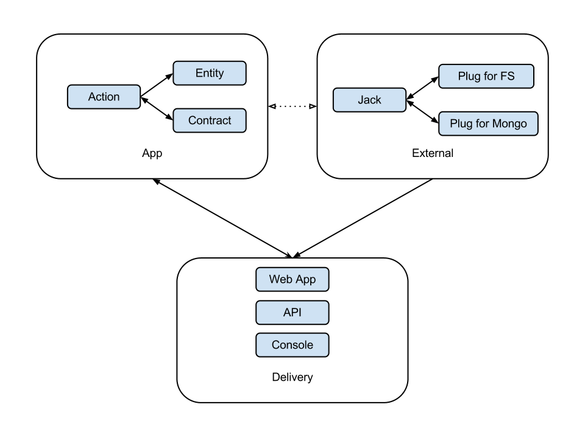

# Obvious

Obvious is a clean architecture framework. The goal is to provide architectural structure for a highly testable system that is obvious to understand and where both the front end UI and back end infrastructure are treated as implementation details independent of the app logic itself.

<iframe width="560" height="315" src="https://www.youtube.com/embed/hxDDjVRUP1I" title="YouTube video player" frameborder="0" allow="accelerometer; autoplay; clipboard-write; encrypted-media; gyroscope; picture-in-picture"></iframe>

## Design Principles

- Obvious Functionality
- Framework Independence
- Extreme Testability
- Maintenance Minded

### Obvious Functionality

When looking at the app directory, it should be obvious what kinds of things the application does. This architecture highly values the "glance factor" of the application structure as well as being obvious in where to find things while working with the project.

### Framework Independence

Your application does not need to be a web app, api app, desktop app, or console app. It also doesn't need to be a MySQL, MongoDB, or SQLServer app.

Your app is just a set of data structures and functionality related to those data structures. How your app delivers your app or stores data are implementation details.  

Implementation details can and should change based on your implementation needs, your app logic shouldn't have to change when your implementation requirements do.

### Extreme Testability

This is a TDD biased structure. Each layer and pattern is designed with testing in mind. More importantly, obvious makes testing easier for developers, which should lead to more testing and better software quality.

### Maintenance Minded

When given the choice between short term productivity or long term maintenance, we believe that the right decision is long term maintenance. Many decisions have been made that are counterintuitive from a short term productivity standpoint, but allow for much easier maintenance.

## Structure

There are three well defined folders of each project, which define the three core divisions of a given project - app, delivery, and external. In the default Obvious structure, they exist as actual directories, but they are designed to be decoupled, so there is no reason you couldn't put the app, external, or delivery mechanisms into separate gems if that made sense for your project, but for demonstration purposes we assume them to all live in the same directory.

### App

App is where the core entities, actions, and data contracts of your application are housed.

#### Entities

Entities represent data in your system. They are fairly simple data structures that mostly just contain data and do validation on the data they contain. Simple entities usually only need a shape method to make writing contracts easier, a populate method of populating the object, and a to_hash method for using the object elsewhere.

#### Actions

Actions are the use cases of the system. They are where most of the business logic of the system happens. They are single action objects that take in Jacks as constructor arguments to enable pluggable data sources.

#### Contracts

Contracts define the data transport structures and perform format validation on the hashes. Data flows through the contracts to the jacks and plugs and back. Because the contracts validate both the input and the output, invalid data structures raise an error and actions will fail. This ensures a standard mechanism for pluggable persistence.

### Delivery

Delivery is where you implement the delivery mechanism of your application itself. Delivery is where your app is integrated with external data sources and shown to the user. This means in simplest terms the UI, but it also means creating concrete versions of the external objects, such as data jacks, and also calling the actions of the app itself.

If your system contains multiple delivery mechanisms - multiple web apps, api's, command line apps, etc. each project would live in a subdirectory of the delivery directory. You also could make your app and delivery directories into gems and have each delivery mechanism be its own directory.

### External

External is where data transport between your app and various external infrastructure lives. This could be datbases, queues, or caching layers connected to various data systems such as Redis, MongoDB, MySQL, the filesystem etc.

### Jacks

Jacks are the classes that inherit from Contracts. A contract is designed to wrap a jack method so that validation on the input and output hashes can be done. Jacks don't define a particular persistance mechanism, but instead act more as a routing mechaism to various plugs.

### Plugs

Plugs are the objects that talk to external systems such as queues, databases, caching, 3rd party API's and so on. A single Jack can have multiple plugs that plug into it. For example, you might have a BlogPostJack that has a BlogPostPlugForMySQL and a BlogPostPlugForMongo and a BlogPostPlugForFS. In that scenario you could swap out MySQL for Mongo or the Filesystem at any time.

## Hashes as Data Transport

The fundamental data structure of data transport between layers is a hash, ideally an immutable hash or struct. This is for both incoming and outgoing data from the each layer. There are many benefits to this approach. The biggest benefit is that each layer stays decoupled from the other layers and that hashes act as messages passed between the layers. Immutable hashes or structs are preferable to mutable ones so that the messages stay in their original state.

Other benefits include:

Your delivery mechanism is only handed data, so you have less likelhood of logic in your controllers or views (unless you do a bad thing). Your Jacks are only handed data, so contracts are able to validate their structure to ensure that Jacks and Plugs won't break your system. Also, Plugs only handing back data means your application isn't tied to the data structures of a particular ORM or persistence library. Lastly, entities are populated with hashes, so it is easy to validate returned from the Jacks using the Entity.populate method.

## Examples

[Obvious Status](https://github.com/retromocha/obvious_status) - A twitter clone status update app. It is designed as an example app, so you can follow the commits to get an idea of how an app would progress step-by-step.

Currently Obvious Status can be run as a web app, JSON api, command line app, or a desktop app using jruby. Data can be stored with JSON files, MySQL, MongoDB, or even the JSON api. You can pick from any of those options without changing your app folder code.

## Project Generator

You can start using Obvious in Ruby by installing the ruby gem. Just `gem install obvious`. To run it, call `obvious generate` in a folder containing a `descriptors` folder with obvious yml descriptor files inside. The obvious generator will look at all of the action descriptors and will generate stub classes and pending tests for your project.

*NOTE:* descriptors are awesome for getting a new app folder structure going, but are basically ignored after your app is created. At some point in the future, the Obvious app generator will get a bit smarter and descriptors could be useful in an ongoing design process, but for now they make bootstrapping easier and that's it.

### Example Descriptor File

An [example obvious descriptor](https://gist.github.com/4367147) file is available as a gist. It's a yaml file. It is designed to be for generate pseudocode and related tests. the c: elements are comments and the requires: elements determine what we think that method might need for that comment.

## Obvious Language Choice

Obvious is written in Ruby, but there is nothing particularly language specific about the Obvious concepts and structure. The structure could be used effectively in any object oriented language - PHP, Java, C#, Python, Scala, Lua, Javascript, ActionScript, Ruby, C++, or Smalltalk it doesn't matter.

## Credit

### The Obvious Team

[Brian Knapp](https://twitter.com/_brianknapp) and [Shawn Baden](https://twitter.com/shawnbaden)

### Inspiration

[Uncle Bob Martin](https://twitter.com/unclebobmartin) - The [keynote at Ruby Midwest 2011](https://www.youtube.com/watch?v=WpkDN78P884) outlined the structure and ideas that became the Obvious Architecture.

[Alistair Cockburn](https://twitter.com/TotherAlistair) - The Hexagonal Architecture ports and adapters concept directly influenced the idea of jacks and plugs in Obvious. In fact, the biggest reason they aren't named ports and adapters in Obvious is to avoid architecture confusion.
